# Dom Manipulation Assignment

1. Webiste Name: [Dev To](https://dev.to/)

### Topics

    - Query Selctory, Inner HTML

### Tasks

    Target the Top description div and change the DEV Community to<Your_Name> and description to your passion

### Task one code

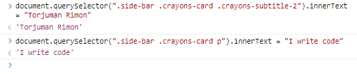

### Task one output

2. Website Name: [Apple](https://support.apple.com/en-in)

### Task

### Fetch all the product name and store in an array

### Task Two code

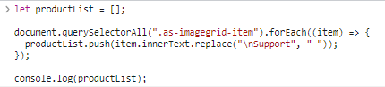

### Task Two output

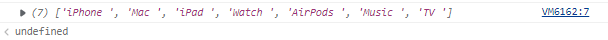

3. Webiste Name: [Youtube Support](https://support.google.com/youtube/)

### Topics

    - Get Element By Id, Create Element, Create Text Node, Append Child

### Sample Image

### Tasks

     Add another FAQ 'My New FAQ' to the list

### Task three code

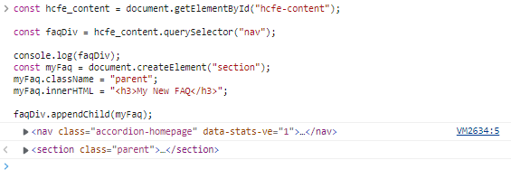

### Task three output

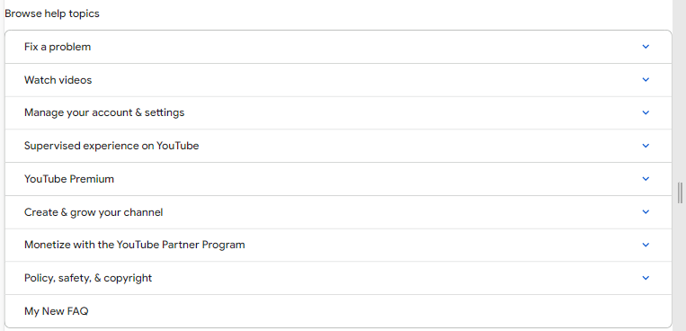

4. Webiste Name: [OnePlus](https://www.oneplus.in/support)

### Topics

    Query Selector, InnerText

### Sample Image

### Tasks

    Change the contact number

### Task four code

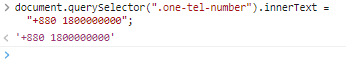

### Task four output

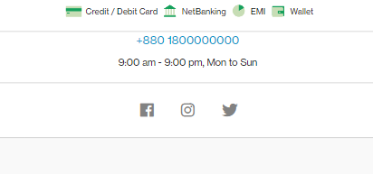

5. Webiste Name: [Samsung](https://www.samsung.com/in/offer/online/samsung-fest/)

### Topics

    getElementById, createElement, InnerText, append, setAttribute

### Sample Image

### Tasks

    Target the main div of card and change the Button text to Check out

### Task five code

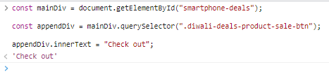

### Task five output

6. Webiste Name: [Adidas](https://www.adidas.co.in/)

### Topics

    -   Query Selector, Event listeners, Changing Styles

### Sample Image

### Tasks

    Target the search box and on hover change thebackground color to red.

### Task six code

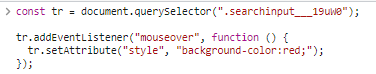

### Task six output

7. Webiste Name: [MDN Web Docs](https://developer.mozilla.org/en-US/)

### Topics

    Form, Value, Submit

### Sample Image

### Tasks

    To Search a topic in the MDN Search bar.
    First add a text to search in the search bar and then hit the submitsearch button to search the docs using DOM

### Task seven code

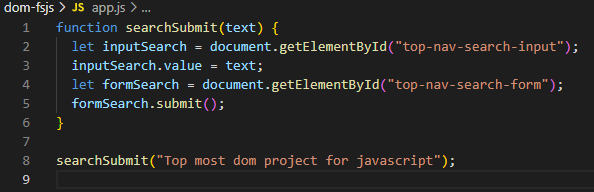

### Task seven output

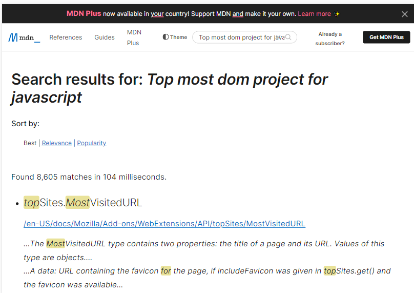
