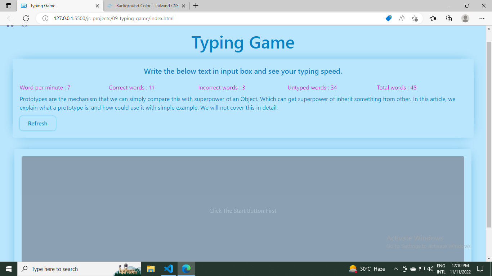

# Typing Game

On clicking on start typing the counter starts and displays the time the user takes to type. This is build on Vanilla JavaScript.

## Image

 

- **[Live Link](https://tr-js-mini-projects.netlify.app/js-projects/09-typing-game/index.html)**

 

# Tech used

  
